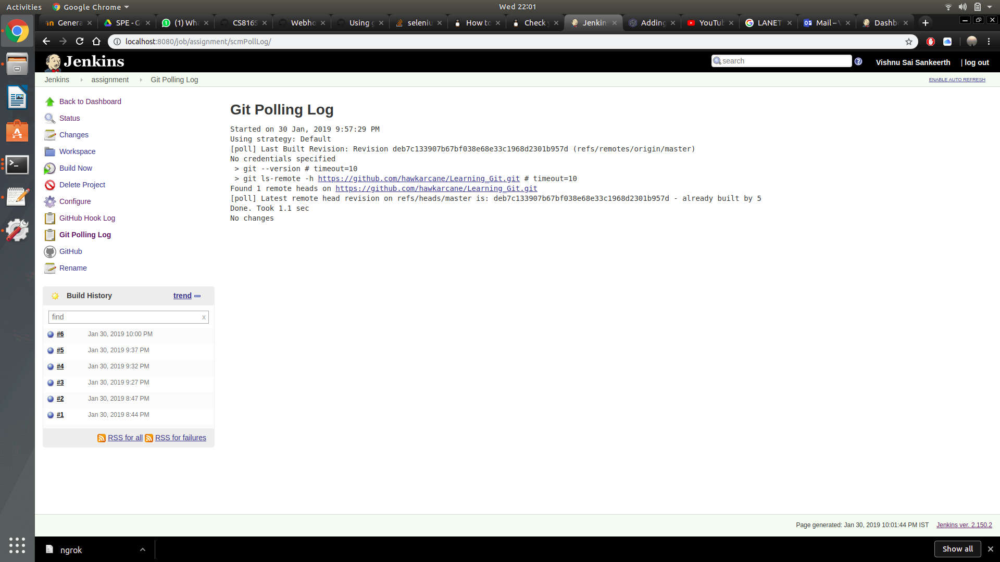
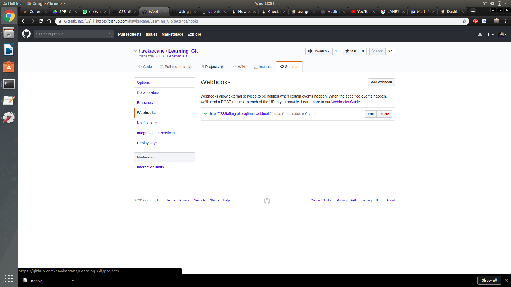
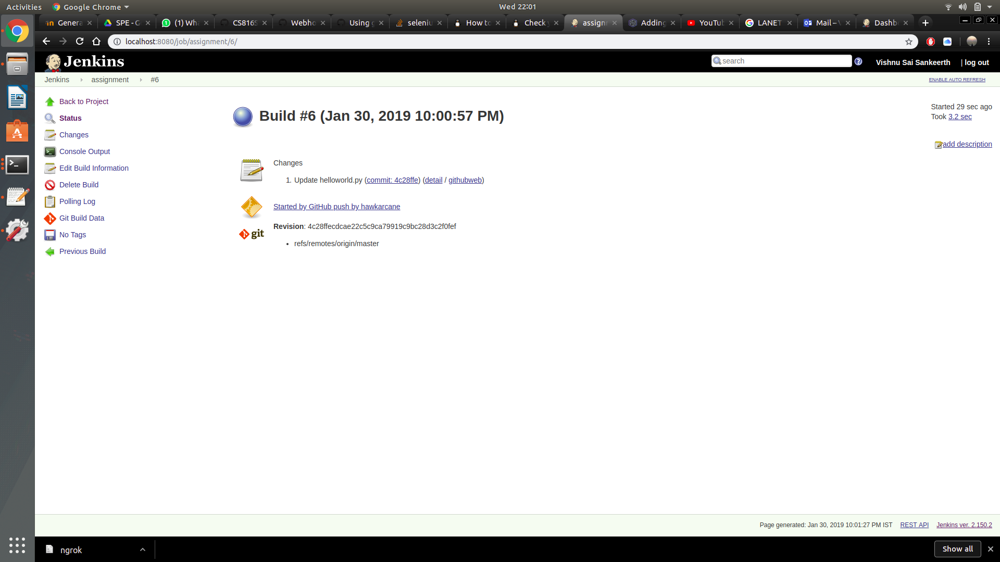
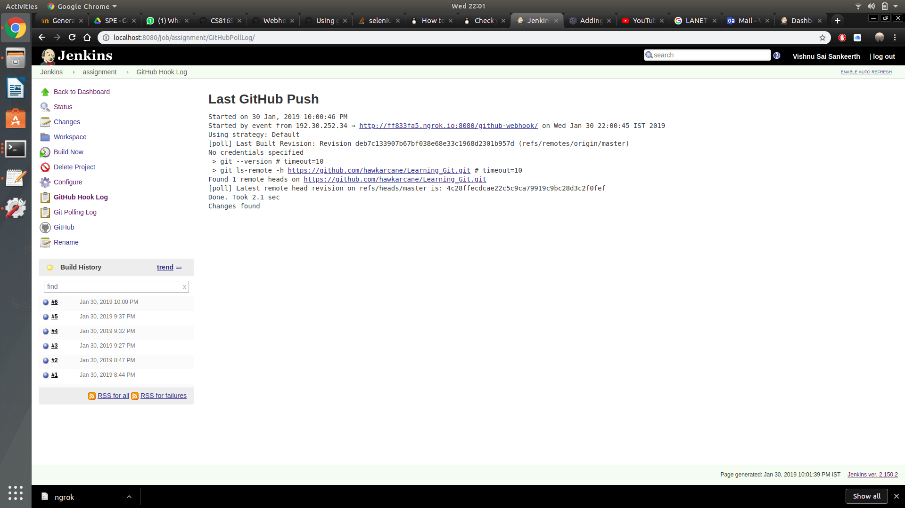

# jenkins-github Assignment
- Create a simple Job, and the build action of the job can be something simple like ```echo "Hello World!"```
- Connect the job to your GitHub Assignment repository using Git SCM Poll for every 5 seconds
- Whenever you commit to your repository, the Jenkins job should run automatically.


# These are the tasks I've implemented in this assignment
- A simple job "python helloworld.py" is created
- And the job has been connected to my github repository using GIT SCM Poll for every 5 minutes
- And the jon runs automatically as soon as one commit changes to the repository.
The screenshots for above tasks are shown below





